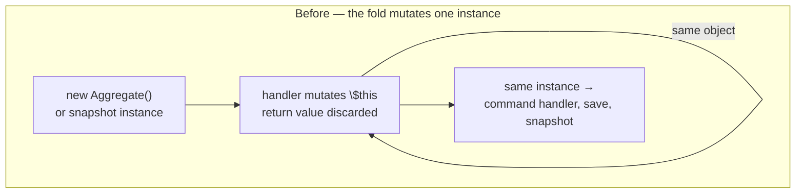
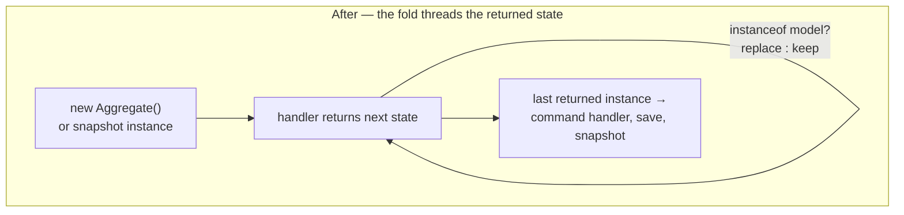

# A stateless `#[EventSourcingHandler]`: what it would mean, cost, and what to ship

*Research and proposal. 2026-09-30, base `dgafka/ecotone-2-0-work` @ `f18765ce4` (DCB shipped). Nothing is
implemented. No production code or test is changed. The only things run against the codebase were throwaway
benchmarks in the scratchpad, described in Part 5 and deleted.*

---

## Part 0 — The recommendation in one paragraph

**Ship the stateless fold by allowing an `#[EventSourcingHandler]` to declare the model's own type as its return
type, and thread that returned value through the fold.** Detection is the declared return type, and it is free of
back-compatibility risk because Ecotone *already rejects* a non-void event sourcing handler at configuration time
(`EventSourcingHandlerExecutorBuilder.php:54`) — a repo-wide scan of every `#[EventSourcingHandler]` in the tree
found no returning handler outside the fixtures that exist to assert that rejection. Ship it for **decision models
first**, because a decision model is already a pure fold result handed to a handler as a parameter, with no
`#[Identifier]`, no `#[Version]`, and no save path — the change there is genuinely small. For **aggregates**, ship the
same detection but scope the supported shape: the state object may be immutable in every domain property while the
framework-owned `#[Version]` property stays writable, because Ecotone writes the version into the instance by
reflection in two places and PHP 8.2 throws `Error: Cannot modify readonly property` on an initialized `readonly`
property (measured, Part 5.3). Keep `new $class()` as the initial state — a promoted-`readonly` constructor with
defaults satisfies the existing no-arg contract, so **no new initial-state declaration is needed**, which is where
Axon spent most of its complexity budget. The cost of the immutable fold itself is **+0.2–0.35 µs per event** for a
scalar state object, against the 6.3–6.8 µs per event per model that `EventSourcingHandlerExecutor::fill` already
costs (`2026-09-29-dcb-fold-cost.md`, Part 0) — that is 3–5% of existing fold cost, and not a reason to refuse. The
real cost is a modelling hazard, not a framework one: a state object that copies a growing collection on every event
turns the fold quadratic, measured at 20 µs per event by 10 000 events, three times the entire existing per-event
cost. Two things I would **not** build: a static `(state, event) -> state` handler form, and any attempt to let a
command handler emit several events and see each one folded before the next decision.

---

## Part 1 — What other frameworks actually do

Every claim in this part was verified against primary sources fetched during this research — official reference
docs, framework source on GitHub, and issue threads. Nothing here is from recall. Where I could not verify a claim I
say so.

### 1.1 Axon Framework 5 (Java) — the closest analogue, and it supports both styles

Axon 4's `@EventSourcingHandler` mutated the aggregate, exactly as Ecotone's does today. Axon 5 added the returning
form and kept the mutating one. Its own migration guide states the intent:

> Event-sourced entities can now be created in an immutable fashion, which wasn't possible before Axon Framework 5.
> This allows you to create entities out of Java records or Kotlin data classes
> […] To evolve, or change the state, of an entity, `@EventSourcingHandlers` or `EntityEvolvers` can return a new
> instance of the entity based on an event. This entity will then be used for the next command or next event.

— [`axon-5/api-changes/07-entities-and-test-fixtures.md`](https://github.com/AxonIQ/AxonFramework/blob/main/axon-5/api-changes/07-entities-and-test-fixtures.md)

What a user writes:

```java
record MyEntity(String id, String name) {
    @EventSourcingHandler
    public MyEntity on(MyEntityNameChangedEvent event) {
        return new MyEntity(id, event.getNewName());
    }
}
```

**How Axon decides which style is in use — this is the single most useful finding.** It does not look at the declared
return type, an annotation flag, or a marker interface. It inspects the *runtime value* and keeps the existing
instance when the value is not usable as the entity:

```java
private E entityFromStreamResultOrUpdatedExisting(MessageStream.Entry<?> potentialEntityFromStream, E existing) {
    if (potentialEntityFromStream != null) {
        var resultPayload = potentialEntityFromStream.message().payload();
        if (resultPayload != null && entityType.isAssignableFrom(resultPayload.getClass())) {
            return (E) entityType.cast(resultPayload);
        }
    }
    return existing;
}
```

— [`AnnotationBasedEntityEvolvingComponent.java:211`](https://github.com/AxonIQ/AxonFramework/blob/main/modelling/src/main/java/org/axonframework/modelling/annotation/AnnotationBasedEntityEvolvingComponent.java)

Value-based detection is what let Axon add the feature without breaking a single Axon 4 handler. The underlying
abstraction Axon exposes is the stateless fold outright — `entityEvolver((entity, event, context) -> entity)` — with
the mutating annotated handler implemented on top of it by returning the same instance.

**Where the initial state comes from.** This, not the return value, is where Axon spent its design budget. Axon 5
offers three `@EntityCreator` forms, and the reference guide ties each to a mutability style:

| Creator form | Before any event | Suited for |
|---|---|---|
| no-argument | exists (empty default) | mutable entities |
| identifier-based (`@InjectEntityId`) | exists, id set | id final, rest mutable |
| first-event-based (event payload arg) | `null` (absent) | fully immutable, every field final |

> First-event-based creator: Suited for fully immutable entities: every field is final, set once when the entity is
> created from its creation event. Subsequent state changes produce a new instance returned from the
> `@EventSourcingHandler`. When this form is used, command handlers must be split into creational and instance
> command handlers.

— [Entity Creator, Axon 5.0 reference](https://docs.axoniq.io/axon-framework-reference/5.0/commands/entities/entity-creator/)

That last sentence is the price: the fully immutable form forces a restructuring of the command side. Note also that
`@InjectEntityId` exists purely to disambiguate an identifier parameter from an event payload — evidence that once
the creator method takes arguments, you inherit an overload-resolution problem.

**The newest direction, still open.** [PR #4948](https://github.com/AxonIQ/AxonFramework/pull/4948) adds a *static*
`@EventSourcingHandler` taking a nullable state as its first argument, making `null` the initial state and unifying
existence:

```java
@EventSourcingHandler
static Account on(@Nullable Account state, Opened event) { return new Account(event.id(), 0); }
```

Its truth table for the transition is worth recording, because it is the decision Ecotone would face:

| Current state | Returns | Outcome |
|---|---|---|
| `null` | non-null | created |
| `null` | `null` | stays `null` — decline to create |
| non-null | non-null | evolved |
| non-null | `null` | rejected (`StateEvolvingException`) |

The PR also states the property the maintainer's brief asks for, in Axon's words: *"Because command-side injection
and sourcing run the same evolve fold, the state a command handler receives is exactly the state replay would
produce."*

**A cost the returning style introduced.** [Issue #3784](https://github.com/AxonIQ/AxonFramework/issues/3784):
polymorphic immutable entities did not evolve, because the type check `existing.getClass().isAssignableFrom(...)`
rejects a *sibling* type in a sealed hierarchy. The recommended workaround was to wrap the polymorphic state inside a
stable entity type. If Ecotone checks `instanceof $aggregateClassName`, it inherits this exact limitation.

**A cost the mutating style introduced.** [Issue #4865](https://github.com/AxonIQ/AxonFramework/issues/4865): an
in-memory snapshot store held the entity *by reference*, so a mid-stream snapshot of a **mutable** entity kept being
mutated by later events; sourcing then replayed the trailing events on top of already-final state and produced 8
instead of 5. The maintainers' own conclusion: *"Any other SnapshotStore implementation is unaffected, because they
all go through actual (de)serialization […] so is any immutable entity, since it can't be mutated after being handed
to the store."* This is directly relevant to Ecotone and is picked up in Part 4.6.

**What took so long.** [Issue #3313](https://github.com/AxonIQ/AxonFramework/issues/3313) is the original community
request — filed for records-as-state — and it slipped several milestones. The blocker was architectural, not
conceptual: the existing event-handling component *discarded handler results*. As a maintainer put it, *"we do not
want a `MessageStream` result based on an `@EventSourcingHandler` annotated method […] mapping the
`AnnotatedEventHandlingComponent`, which does use a `MessageStream` as the result, doesn't fit."* Ecotone has the
same obstacle in a milder form: `AggregateMethodInvoker::executeMethod()` returns `void`.

### 1.2 Marten (.NET) — both styles, selected by return type, and a cautionary tale

Marten's `Apply` conventions are explicit about the two styles and pick between them on the **declared return type**:

> The valid return types are: 1. `void` if you are mutating the aggregate document 2. The aggregate type itself, and
> this allows you to use immutable aggregate types 3. `Task` if you are mutating the aggregate document with the use
> of external data read through `IQuerySession` 4. `Task<T>` where `T` is the aggregate type.

— [Aggregation with Conventional Methods](https://martendb.io/events/projections/conventions)

The immutable form is static and takes the current state as a parameter:

```csharp
public sealed record QuestParty(Guid Id, List<string> Members)
{
    public static QuestParty Create(QuestStarted started) => new(started.QuestId, []);
    public static QuestParty Apply(MembersJoined joined, QuestParty party) =>
        party with { Members = party.Members.Union(joined.Members).ToList() };
}
```

Marten's stated position is neutral: *"Marten happily supports immutable data types for the aggregate documents
produced by projections, but also happily supports mutable types as well."*
([Aggregate Projections](https://martendb.io/events/projections/aggregate-projections.html)) I found no Marten
document recommending one over the other, and no allocation or performance guidance comparing them.

**Two community lessons, both about detection, both expensive.**

[PR #2560](https://github.com/JasperFx/marten/pull/2560) proposed inferring "immutable" from `static Apply`. Jeremy
Miller rejected it on back-compatibility grounds, and the reasoning transfers directly:

> It is a breaking change because it disallows users from using static methods on mutable aggregations **as they may
> be doing today**. […] This could break currently existing code without being too obvious about why. I appreciate
> that you don't think the usage I worry about here is valid, but you have no earthly idea what *other* people might
> already be doing.

[Issue #4551](https://github.com/JasperFx/marten/issues/4551) is the footgun that the state-returning form creates.
A `static Apply` that returns the aggregate but omits the current-state parameter silently *replaces* the snapshot on
every event instead of accumulating:

> a `static` `Apply` that **returns the aggregate** and has **no parameter of the aggregate type** has no access to
> prior state, so it **replaces** the snapshot from each event instead of accumulating. […] intentional-replace and
> forgotten-param are byte-identical signatures so it can't distinguish intent without an opt-in marker.

Marten chose to allow and document it rather than reject it, because rejecting would break a released major.

[Issue #3850](https://github.com/JasperFx/marten/issues/3850) is the one that matters most for the brief's
"command handler runs against the last state returned by the fold" requirement. A user reported that `FetchLatest`
returned pre-update state for an immutable `record` aggregate while the identical flow on a mutable class worked.
Root cause per the maintainer: *"It's from identity map mechanics. Works as expected w/o the identity map"* — fixed
in [PR #3855](https://github.com/JasperFx/marten/pull/3855). **Any cache or identity map that holds the loaded
instance silently keeps working for the mutating style and silently breaks for the returning style**, because the
mutating style updates the cached object in place and the returning style does not.

### 1.3 Akka / Pekko Persistence (Scala/Java) — one signature, both styles

`EventSourcedBehavior` is built on three explicit pieces: `persistenceId`, `emptyState`, `commandHandler`, and an
`eventHandler` typed `(State, Event) => State`. Its documentation is the most direct statement of the trade-off I
found anywhere:

> The state is typically defined as an immutable class and then the event handler returns a new instance of the
> state. You may choose to use a mutable class for the state, and then the event handler may update the state
> instance and return the same instance. Both immutable and mutable state is supported, but it must only be modified
> in the event handler.

> If the state is mutable, it is important that the `emptyState` method creates a new State instance each time it is
> called to ensure that the state is recreated in case of failure restarts. It is recommended to use an immutable
> state class.

— [Akka Event Sourcing](https://doc.akka.io/libraries/akka-core/current/typed/persistence.html); the
[Pekko](https://pekko.apache.org/docs/pekko/current/typed/persistence.html) text is identical minus the
`withMutableState` note

The second paragraph is a warning Ecotone should read carefully. Akka needs a special factory for mutable state
precisely because *a single mutable initial instance reused across folds leaks state between folds*. Ecotone's
`new $this->aggregateClassName()` per `fill()` call already avoids that, but the hazard class is the same one behind
Axon #4865.

### 1.4 Emmett and the Decider pattern — stateless only, and the literature's default

Emmett's whole model is the fold: `events.reduce<State>(evolve, initialState())`, with

```ts
export const evolve = (state: ShoppingCart, event: ShoppingCartEvent): ShoppingCart => { … }
```

and an explicit `initialState()`. Its event store exposes `aggregateStream(streamName, { evolve, initialState })`.
There is no mutating option. — [Emmett getting started](https://event-driven-io.github.io/emmett/getting-started.html)

The Decider pattern that Ecotone's DCB decision models resemble is the source of that shape. Jérémie Chassaing's
original write-up defines it precisely:

> Let's call this function `evolve`; its signature is: `type Evolve = State -> Event -> State` […] The code of the
> evolve function should be extremely simple; the Decision has already been taken. It should probably not be more
> that setting a field, adding a element to a list, incrementing a value, or setting/resetting a flag.

> The Initial State is important as it has to be explicitly defined. […] In languages without sum types, we'll
> usually use a boolean or enum value to mark the difference.

— [Functional Event Sourcing Decider](https://thinkbeforecoding.com/post/2021/12/17/functional-event-sourcing-decider)

Two things to carry forward. The `evolve` body is expected to be trivial, which caps how much the allocation cost can
matter. And the "languages without sum types" note is PHP's situation: a PHP initial state is a default-valued
object, not a distinct `Initial` case, which is exactly what `new $class()` already gives.

### 1.5 Eventuous (.NET) — stateless only, identity outside the fold

`State<T>` is an abstract `record` whose `When` returns the next state, with handlers registered as
`Func<T, TEvent, T>`; when no handler matches it returns `this`:

```csharp
public abstract record State<T> where T : State<T> {
    public virtual T When(object @event) {
        if (!_handlers.TryGetValue(@event.GetType(), out var handler)) return (T)this;
        return handler((T)this, @event);
    }
}
```

— [`State.cs`](https://github.com/Eventuous/eventuous/blob/master/src/Core/src/Eventuous.Domain/State.cs)

One detail is directly useful: identity is *not* part of the fold. `State<T, TId>` declares
`public TId Id { get; internal set; }`, set by the framework when the state is loaded. Eventuous took the identifier
out of the user's evolve function entirely.

### 1.6 Cross-framework summary

| Framework | Fold signature the user writes | Initial state | How the style is decided | Both styles? |
|---|---|---|---|---|
| Axon 5 | `E on(Event e)` returning `E`, or `void on(Event e)` | `@EntityCreator`: no-arg, id-based, or first-event | runtime value is assignable to entity type | yes |
| Marten | `static Agg Apply(Event e, Agg current)`, or `void Apply(Event e)` | `Create(Event)` method | declared return type | yes |
| Akka / Pekko | `(State, Event) => State` | explicit `emptyState` | same signature; mutable returns `this` | yes |
| Emmett / Decider | `evolve(state, event): State` | explicit `initialState()` | n/a — only stateless | no |
| Eventuous | `On<TEvent>((state, e) => state with {…})` | `record` defaults; `Id` set by framework | n/a — only stateless | no |

**What the community actually prefers.** The honest answer from the evidence is that nobody with both options tells
users to pick one. Akka is the only source that states a preference (*"It is recommended to use an immutable state
class"*), and its reason is operational — mutable state is unsafe across actor restarts — not aesthetic. What the
community evidence does establish is sharper and more useful than a preference: **every framework that added the
returning style to an existing mutating one kept both, and the defects that followed clustered in three places** —
detection that reinterprets an existing valid shape (Marten #2560), caches that hold the loaded instance (Marten
#3850), and initial-state/creator ambiguity (Axon `@InjectEntityId`, Marten #4551). Those three are the risk list
for Ecotone, and Part 4 answers each.

I could not establish: whether Axon or Marten users predominantly *choose* the immutable form in practice (no survey
or telemetry is public), and I found no framework documenting a measured allocation cost for the immutable fold.

---

## Part 2 — What Ecotone does today

One entry point: `packages/Ecotone/src/Modelling/EventSourcingExecutor/EventSourcingHandlerExecutor.php`.

```php
public function fill(array $events, ?object $existingAggregate): object
{
    $aggregate = $existingAggregate ?? (new $this->aggregateClassName());
    foreach ($events as $event) {
        // … build a Message from the event payload and metadata …
        foreach ($this->eventSourcingHandlerMethods as $eventSourcingHandler) {
            if ($eventSourcingHandler->canHandle($eventPayload)) {
                $this->aggregateMethodInvoker->executeMethod($aggregate, $eventSourcingHandler, $message);
            }
        }
    }
    return $aggregate;
}
```

`fill()` already *returns* the state, and all three call sites already use the return value:
`GroupedEventSourcingExecutor::fillFor` (line 45), `DecisionModelParameterLoader::fold` (line 84), and
`AggregateBackedDecisionModelLoader` (line 62). The only thing missing is that
`AggregateMethodInvoker::executeMethod()` is typed `void`, so the handler's own return value is dropped.

**Five contracts the current design leans on**, each of which the stateless style has to respect:

- **A public no-argument constructor.** `EventSourcingHandlerExecutorBuilder.php:28-36` rejects a constructor with
  parameters or a non-public one. `new $class()` is the initial state.
- **A non-void return is already a configuration error.** Line 54: *"is Event Sourcing Handler and should return void
  return type"*. Line 46 rejects `static`. Both are asserted by
  `LoadAggregateServiceBuilderTest::test_throwing_exception_if_event_sourcing_handler_is_non_void` and its `_is_static`
  sibling, over the fixtures in `tests/Modelling/Fixture/IncorrectEventSourcedAggregate/`.
- **A `#[Version]` property is mandatory for event-sourced aggregates.** `CallAggregateServiceBuilder::initialize`
  asserts it, pointing users at `WithAggregateVersioning`.
- **The version is written into the instance by reflection, twice.** After load in
  `EventSourcedRepositoryAdapter::findBy` (line 103) and before save in
  `SaveAggregateServiceTemplate::enrichVersionIfNeeded`, both through
  `PropertyEditorAccessor::enrichDataWith`, which ends in `$classProperty->setValue($dataToEnrich, …)`.
- **Two aggregate flavours already exist.** A *pure event-sourced* aggregate's command handler returns an array of
  events, which `AggregateResolver::resolveEvents` reads off the message payload; an *internal event recorder*
  aggregate mutates itself and collects events via `WithEvents::popRecordedEvents`.

Decision models are notably lighter. `DecisionModelParameterLoader::fold(array $events, ?object $snapshotState): object`
is already a fold in shape; the result is handed to the command handler as a method parameter via
`DecisionModelConverter`, and is never saved. A decision model has **no `#[Identifier]` and no `#[Version]`** — expected
versions live outside the model in the `AppendCondition`. Its snapshots round-trip through real JSON serialization
(`DecisionModelSnapshotStore::serialize`), and a `DecisionModelFoldShape` hash of (class, handled events, scope names)
invalidates a snapshot whose fold changed. Unlike the aggregate builder, `DecisionModelDefinitionBuilder` does **not**
check for a void return — a returning decision-model handler is accepted today and its value silently discarded.

### Before and after, for an aggregate load





---

## Part 3 — What a user writes, and what Ecotone does with it

### 3.1 Stateful — unchanged

```php
#[EventSourcingAggregate]
final class Ticket
{
    use WithAggregateVersioning;

    #[Identifier]
    private string $ticketId;
    private bool $closed = false;

    #[CommandHandler]
    public static function register(RegisterTicket $command): array
    {
        return [new TicketWasRegistered($command->ticketId)];
    }

    #[CommandHandler]
    public function close(CloseTicket $command): array
    {
        return $this->closed ? [] : [new TicketWasClosed($this->ticketId)];
    }

    #[EventSourcingHandler]
    public function applyRegistered(TicketWasRegistered $event): void
    {
        $this->ticketId = $event->ticketId;
    }

    #[EventSourcingHandler]
    public function applyClosed(TicketWasClosed $event): void
    {
        $this->closed = true;
    }
}
```

### 3.2 Stateless — the proposed shape

```php
#[EventSourcingAggregate]
final class Ticket
{
    use WithAggregateVersioning;

    public function __construct(
        #[Identifier]
        public readonly string $ticketId = '',
        public readonly bool $closed = false,
    ) {
    }

    #[CommandHandler]
    public static function register(RegisterTicket $command): array
    {
        return [new TicketWasRegistered($command->ticketId)];
    }

    #[CommandHandler]
    public function close(CloseTicket $command): array
    {
        return $this->closed ? [] : [new TicketWasClosed($this->ticketId)];
    }

    #[EventSourcingHandler]
    public function applyRegistered(TicketWasRegistered $event): self
    {
        return new self($event->ticketId, $this->closed);
    }

    #[EventSourcingHandler]
    public function applyClosed(TicketWasClosed $event): self
    {
        return new self($this->ticketId, true);
    }
}
```

The constructor is still public and still callable with no arguments, so `new $class()` keeps working as the initial
state. Every domain property is `readonly`. `WithAggregateVersioning` contributes a writable `private int $version`,
which the framework owns.

### 3.3 What Ecotone does, step by step

| Step | Stateful (today) | Stateless (proposed) |
|---|---|---|
| **On load** | `fill()` mutates one instance; version written into it by reflection | `fill()` reassigns from each handler's return; version written into the last instance by reflection |
| **On command handling** | handler runs on the loaded instance | handler runs on the *last instance the fold returned* — the same header, `CALLED_AGGREGATE_INSTANCE`, no change needed |
| **On save** | new events folded onto the same instance by `AggregateResolver::resolveAggregateInstance` | same call, but `fillFor` returns a new instance; that instance is what gets version-enriched, identifier-read and stored |
| **On snapshot restore** | deserialized instance is passed as `$existingAggregate` and mutated forward | deserialized instance is passed as `$existingAggregate` and *replaced* forward |

For a decision model the flow is shorter and the change smaller: `fold()` already returns the state, and that state is
already only ever passed to the handler as an argument and serialized for a snapshot. Nothing writes into it.

---

## Part 4 — Design options, with a recommendation for each

### 4.1 How is the style detected?

| Option | Behaviour | Cost |
|---|---|---|
| **A — declared return type** *(recommended)* | `: self`/`: static`/`: <ModelClass>` means stateless; `: void` means stateful; anything else stays a configuration error | needs the existing line-54 check relaxed to "void, or the model's own type"; fails fast at config time |
| B — runtime value, as Axon | thread whatever the handler returns when it is `instanceof` the model | silently tolerates a handler that returns a value by accident; cannot report a mistake at config time |
| C — attribute flag, e.g. `#[EventSourcingHandler(stateless: true)]` | explicit opt-in | redundant with the return type; two sources of truth that can disagree |
| D — per-class declaration or marker interface | one decision per aggregate | forbids mixing, which the migration path needs |

**Recommend A.** Ecotone's configuration-time validation is an asset here that Axon and Marten did not have: because
a non-void event sourcing handler is *already* rejected, the return type is an unambiguous, unused signal. Option B
is right for Axon because Axon 4 handlers could legally return things; that is not Ecotone's situation.

**Is this a breaking change? No.** Concretely:

- For aggregates, a returning handler throws `ConfigurationException` today, so no working application has one.
- Repo-wide, every `#[EventSourcingHandler]` was scanned outside `vendor/` — 277 in 129 PHP files and 30 in
  documentation samples, across `packages/`, `quickstart-examples/`, `Monorepo/`, `docs/` and `upgrade/`. The only
  non-void signatures are the two fixtures that exist to assert the rejection, plus two matches where the signature
  spans lines because of a `#[Header]` parameter and the scan's regex stopped early.
- For decision models there is one genuine gap: `DecisionModelDefinitionBuilder` never checked for a void return, so
  a returning handler is accepted and ignored. Since decision models ship for the first time in 2.0, the installed
  base is zero, but the *semantics* of such a handler would change from "ignored" to "threaded". Adding the same
  void-or-model-type check there closes it either way.

Also decide, when adopting A: **reject a stateless handler whose return value is not the model's type at runtime**,
rather than falling back to the previous state. Marten #4551 is the whole argument — a silently-replacing fold is a
data-loss shape nobody can distinguish from intent after the fact.

### 4.2 Where does the initial state come from?

**Recommend: keep `new $class()` and change nothing.** A promoted-constructor `readonly` class whose every parameter
has a default is no-arg constructible, so the existing contract in `EventSourcingHandlerExecutorBuilder.php:28-36`
already admits fully immutable state. Verified on PHP 8.2.29: `new ImmutableLedgerNew()` with four defaulted
promoted `readonly` parameters constructs fine.

The alternatives all cost more than they return:

- **A static factory or `#[InitialState]` declaration** — a second way to say what a defaulted constructor already
  says.
- **A nullable first state argument** (Axon PR #4948, Marten's `static Apply(e, current)`) — requires the static
  handler form, which Part 6 argues against, and imports Axon's four-case `null` truth table plus Marten #4551's
  forgotten-parameter footgun.
- **First-event-based construction** — the fully-immutable ideal, and the reason Axon had to split command handlers
  into creational and instance forms. That is a large change to Ecotone's command side for a property PHP's default
  arguments already deliver.

The honest trade-off of the recommendation: the state object is *reachable* in a meaningless all-defaults state
(`ticketId === ''`), which a first-event constructor would make unrepresentable. Decider's own note that languages
without sum types mark the initial state with a flag or default is the precedent for accepting that.

### 4.3 Immutability in PHP 8.2 — what is actually possible

Property-level `readonly` on promoted constructor parameters, plus `with*()`-style methods returning `new self(...)`,
works on 8.2 and is the shape in Part 3.2. Two hard limits, both measured:

**`readonly` and `#[Version]` are incompatible.** Ecotone writes the version into the instance by reflection in two
places. On PHP 8.2.29, `ReflectionProperty::setValue()` against an initialized `readonly` property throws:

```
WithReadonlyVersion: Error: Cannot modify readonly property WithReadonlyVersion::$version
WithPlainVersion: reflection write OK
initialized readonly: Error: Cannot modify readonly property class@anonymous::$version
```

So `readonly class Ticket` (class-level) is impossible for an event-sourced aggregate, and the supported shape is
"immutable in every domain property, with the framework-owned `#[Version]` writable". `WithAggregateVersioning`
already provides exactly that property, so users need no new knowledge.

Two ways out, if the maintainer wants full `readonly`: have `PropertyEditorAccessor` prefer a `withVersion()` method
(it already prefers a `setVersion()` setter before touching reflection), or stop carrying the version inside the
aggregate and read it from the `TARGET_VERSION` header, which the save path already has. Both are larger than this
proposal and belong in Part 9.

**A returning handler cannot use `clone` to dodge the cost.** `clone` on a `readonly`-propertied object produces an
object whose `readonly` properties are already initialized, so they still cannot be reassigned; the handler must call
the constructor. That is what the Part 5 benchmark measures.

### 4.4 Command handlers on an immutable aggregate

**Recommend: the command handler returns events only, never state.** That is the *pure event-sourced* flavour Ecotone
already supports, and it composes with the stateless fold without a single new concept: the handler decides from the
folded state and returns `array<object>`; `AggregateResolver::resolveAggregateInstance` folds those events forward
into the instance to save and snapshot.

There is a concrete reason not to let a command handler return new state:
`AggregateResolver::isNewAggregateInstanceReturned()` already treats *a returned object of a registered aggregate
type as a newly created aggregate*, recursing into `resolveMultipleAggregates` with `TARGET_VERSION` 0. Its only
guard against double-saving is object identity:

```php
if ($resolvedAggregates[0]->getAggregateInstance() === $returnedResolvedAggregates[0]->getAggregateInstance()) {
    return $resolvedAggregates;
}
```

With immutable state that `===` is false by construction, so a command handler returning the evolved `self` would be
saved as a *second, new* aggregate at version 0. Allowing state-returning command handlers means redesigning that
discrimination. Returning events avoids the question entirely.

**"Several events, each visible to the next decision."** Under the pure flavour today, a handler returning
`[A, B]` decides both from the pre-command state; only the save-time fold applies them. Mutating handlers can cheat by
mutating `$this` between decisions. Stateless state cannot, and I recommend not building a fold-as-you-go API for it
(Part 6). The Decider contract — `decide(state, command) -> events` deciding once from one state — is what Emmett,
Eventuous and the literature all do, and a handler that genuinely needs to see its own first event is a signal that
it is two commands. This needs to be documented explicitly, because it is the one place where the two styles are not
behaviourally equivalent.

### 4.5 Interaction with the aggregate's other machinery

| Concern | Effect under a stateless fold |
|---|---|
| `#[Identifier]` | Read *after* the fold, off the final instance, by `SaveAggregateServiceTemplate::getAggregateIds` via property read or a getter — works unchanged on `readonly` properties. A promoted `#[Identifier] public readonly string $id` is read the same way. |
| `#[Version]` / `#[TargetVersion]` | The blocker of Part 4.3. `#[Version]` must stay writable. `#[TargetVersion]` is unaffected: it is read off the *command*, not the aggregate. |
| `#[AggregateType]` | Unaffected — a class-level declaration, not state. |
| Recorded events | Mechanically compatible: the trait's `$recordedEvents` is an ordinary mutable private property, and `AggregateResolver::resolveSingleAggregate` pops the events off the called instance *before* folding the new events forward, so nothing is lost. Conceptually it is a mismatch — an immutable state object with a mutating event buffer — and the pure flavour (return events) is the Part 4.4 recommendation. Document the pairing rather than making `recordThat()` immutable. |
| Snapshots | See 4.6. |

### 4.6 Snapshots

Both snapshot paths shipped with DCB, and the stateless style is *better* for both, for a reason Axon paid to learn.

Decision-model snapshots already round-trip through JSON (`DecisionModelSnapshotStore::serialize` / `::load` via
`ConversionService`), so there is no aliasing hazard and an immutable model is no harder to store. The restore side
converts JSON back into `$modelClass`; a promoted-`readonly` constructor is the shape most PHP serializers handle
best, so this is a mild improvement, not a risk.

Aggregate snapshots go through `EventSourcedRepositoryAdapter::save`, which calls
`$documentStore->upsertDocument(…, $aggregate->getAggregateInstance())` — **the live object**. With
`DbalDocumentStore` that is serialized on the way in. With `InMemoryDocumentStore` it is not:
`upsertDocument()` is `$this->collection[$collectionName][$documentId] = $document;`, storing the object by reference.
That is precisely the shape of Axon #4865, where a by-reference in-memory snapshot of a *mutable* entity was mutated
by later events and produced a wrong reconstruction. Immutable state removes the hazard by construction. I have
**not** reproduced a user-visible wrong result in Ecotone from this, and I am not claiming one — the aliasing is
verified by reading `InMemoryDocumentStore`; whether it can be observed depends on the save ordering, and confirming
that deserves its own test rather than an assertion here.

One thing that must change if the style becomes selectable: the **fold-shape hash must include it**.
`GroupedEventSourcingExecutor::foldShapeOf` hashes the class name plus handled event type names, and
`DecisionModelFoldShape::of` hashes class, handled events and scope names. Switching a class from stateful to
stateless changes what the fold computes without changing either input, so existing snapshots would be restored under
the new fold and silently trusted. Adding the style to both hashes makes the existing self-healing path
(*"Snapshot … was taken with a different set of #[EventSourcingHandler] events than the class declares now. Snapshot
ignored to self-heal system."*) cover the migration for free.

### 4.7 Decision models — yes, this is where it belongs first

Everything that makes the stateless style expensive for aggregates is absent for decision models:

- No `#[Version]` inside the model, so no reflection write, so no `readonly` conflict. Expected versions live in the
  `AppendCondition`.
- No `#[Identifier]`, so nothing is read back off the object to key a save.
- No save path at all. The model is a method parameter and a JSON snapshot.
- `DecisionModelParameterLoader::fold(array $events, ?object $snapshotState): object` is already `(state, events) ->
  state` in shape.
- No recorded-events trait, no `isNewAggregateInstanceReturned` collision, no identity map.

And the fit is conceptual, not just mechanical: a DCB decision model *is* the Decider's `State`, and the literature's
shape for it is the returning `evolve`. The only work is threading the return value through
`AggregateMethodInvoker` and adding the void-or-model-type check to `DecisionModelDefinitionBuilder`.

### 4.8 Enterprise or open core?

**Recommend open core, for both aggregates and decision models.** The existing split is about *parameter richness*,
not about the fold: `OpenCoreAggregateMethodInvoker` throws when a handler declares more than one parameter, and
points at Enterprise for metadata access; `EnterpriseAggregateMethodInvoker` runs the full `MethodInvoker` with
parameter converters. Threading a return value is orthogonal to how arguments are resolved, and both invokers need
the same one-line change to return `mixed` instead of `void`.

Gating it would also make the two styles unequal in a way the brief explicitly rules out — the maintainer wants both
first-class. A licence gate on "your aggregate may be immutable" is a gate on a modelling choice, not on a capability
with a cost to Ecotone. Note that decision models are themselves Enterprise-licensed
(`DecisionModelParameterLoader` is `licence Enterprise`), so shipping there first does not create an open-core
obligation; the aggregate path is the one that must stay Apache-2.0, and can.

---

## Part 5 — Cost

### 5.1 What was measured, and how

Three throwaway scripts in the session scratchpad, run with `docker run --rm ecotone/php:8.2.31-dev` (PHP 8.2.29,
the supported floor, no xdebug loaded). Each configuration: 20 repetitions, best-of reported, `gc_collect_cycles()`
between runs. These measure the **fold body only** — no Ecotone bootstrap, no `MessageBuilder`, no reflection — so
they isolate the delta the returning style adds and nothing else. Nothing was committed; no production code was
touched.

The denominator comes from this repo's own prior measurement, not from a guess:
`docs/superpowers/specs/2026-09-29-dcb-fold-cost.md` (Part 0) measured `EventSourcingHandlerExecutor::fill` at
**6.3–6.8 µs per event per model**, of which 3.9 µs is `MessageBuilder` and 1.9 µs of that is `Uuid::v7()` plus a
clock read.

### 5.2 The fold delta

| Fold body, 1 000 events | µs/event | vs. mutate |
|---|---|---|
| mutate in place (today) | 0.62 | — |
| return `new self(...)`, scalar properties only | 0.90 | +0.28 |
| return `new self(...)`, carries a growing array | 3.27 | +2.65 |
| `clone` + return `new self(...)`, growing array | 2.69 | +2.07 |

At 100 events the scalar delta is +0.35 µs/event; at 10 000 it is +0.17 µs/event.

**For a scalar state object the immutable fold costs +0.2–0.35 µs per event — 3–5% of the 6.3–6.8 µs the fold
already costs per event per model.** On the brief's reference point of an uncached Lite at ~10 ms, a 1 000-event
immutable fold adds ~0.3 ms, about 3%. That is below the noise floor the prior fold-cost study established for its
tightest shape (±2% on PostgreSQL) and nowhere near it for the others (±8% to ±43%).

### 5.3 The real cost is quadratic, and it is a modelling hazard

The growing-array rows above are not a constant factor. Extending the sweep:

| Events folded | mutate | return new, growing array |
|---|---|---|
| 100 | 0.56 µs/event | 1.42 µs/event |
| 1 000 | 0.62 µs/event | 3.27 µs/event |
| 10 000 | 0.27 µs/event | 19.90 µs/event |

A state object that copies a collection on every event is **O(n²)**: by 10 000 events the fold body alone costs
19.9 µs per event, three times the entire existing per-event cost, and it keeps growing. The mutating style hides
this because `$this->entries[] = …` is amortised O(1).

This is the number to put in the documentation. It is not an argument against the feature — Decider's own guidance is
that `evolve` should do no more than set a field or append to a list — but a stateless aggregate that accumulates an
unbounded list and rebuilds it per event will degrade in a way its stateful twin does not. The mitigations are
ordinary: keep collections out of long-lived folded state, or snapshot.

### 5.4 The `readonly` probe

Reported in Part 4.3. `ReflectionProperty::setValue()` on an initialized `readonly` property throws
`Error: Cannot modify readonly property` on PHP 8.2.29; on a plain private property it succeeds. This is the finding
that bounds how immutable an Ecotone aggregate can be.

---

## Part 6 — What I would not do

**No static `(state, event) -> state` handler.** It is where Axon is heading (PR #4948) and where Marten already is,
and it buys two things Ecotone does not need: `null` as the initial state, and a fold callable without an instance.
It costs the four-case `null`/non-`null` truth table, Marten #4551's forgotten-parameter data-loss shape, and a
reversal of a rule Ecotone enforces today (`EventSourcingHandlerExecutorBuilder.php:46` rejects `static`). The
instance form with a defaulted constructor delivers the same expressiveness.

**No fold-as-you-go inside a command handler.** Making each event a handler emits visible to its next decision means
either re-entering the fold mid-handler or giving handlers an appender that folds on append. It changes what a
command handler *is*, it has no analogue in the Decider literature, and Axon reached the same place from the other
direction — its immutable form splits creational from instance handlers rather than making a single handler
incremental.

**No first-event-based construction, and no new initial-state declaration.** Axon's most elegant form is also the one
that forced a command-side restructuring. PHP's default arguments give 90% of it for free.

**No class-level `readonly`, and no attempt to make `#[Version]` work inside an immutable object in this change.**
Both are real improvements and both are bigger than this feature. Shipping "immutable except the framework-owned
version" now does not block either later.

**No Enterprise gate.** Part 4.8.

**No change to `upgrade-2.0.md` yet** — per the brief, that waits until this is agreed.

---

## Part 7 — Migration

**A user with 1.x-style mutating handlers does nothing.** `: void` keeps meaning "mutate me", the detection signal is
a return type they do not have, and the two styles can be mixed within one class and across classes in one
application.

The only migration mechanics are internal:

1. `AggregateMethodInvoker::executeMethod()` changes from `void` to returning `mixed`; both implementations return
   their invocation result.
2. `EventSourcingHandlerExecutor::fill()` reassigns `$aggregate` when a handler is stateless.
3. `EventSourcingHandlerExecutorBuilder.php:54` relaxes "must be void" to "must be void, or the model's own type".
4. `DecisionModelDefinitionBuilder` gains the same check, closing the silently-ignored-return gap.
5. `GroupedEventSourcingExecutor::foldShapeOf` and `DecisionModelFoldShape::of` include the style, so a class
   switching styles invalidates its own snapshots through the existing self-healing path.

A user *converting* a class from stateful to stateless is changing what the fold computes, and step 5 makes the stale
snapshot heal itself rather than silently apply the new fold over old state.

---

## Part 8 — Suggested scope, smallest first

1. **Decision models.** Steps 1, 2, 4, 5 above. No `#[Version]`, no save path, no identity concerns. Tests: a
   returning decision-model handler folds correctly; a mixed-style model folds correctly; a returning handler whose
   value is not the model type is rejected; a snapshot taken under one style is ignored under the other.
2. **Pure event-sourced aggregates.** Steps 3 and 5, plus documenting that `#[Version]` stays writable and that
   `WithEvents` is for the stateful style. Tests: load, command, save and snapshot-restore against a
   promoted-`readonly` aggregate.
3. **Documentation.** The two styles side by side, the O(n²) collection warning from Part 5.3, and the explicit
   statement that a command handler decides once from the folded state.

Stopping after (1) still ships something coherent and is where the Decider literature says the style belongs.

---

## Part 9 — Open questions for the maintainer

**OQ-1. Detection: declared return type, or runtime value?** I recommend the declared return type (Part 4.1) because
Ecotone already rejects a non-void handler, so the signal is unambiguous and mistakes are reported at configuration
time. Axon chose the runtime value because it had to. Choosing the runtime value instead would let a handler opt in
without changing its signature, at the price of never being able to report a wrong return as an error. This is the
one decision everything else hangs off.

**OQ-2. Does `#[Version]` stay inside the state object?** The measurement says a fully `readonly` aggregate is
impossible while the version is written into the instance by reflection (Part 4.3). Option (a), recommended for this
change: `#[Version]` stays writable, domain properties are `readonly`, `WithAggregateVersioning` unchanged. Option
(b): move the version out of the aggregate and read it from the `TARGET_VERSION` header the save path already
carries, which makes `readonly class` possible and is a larger change to the aggregate contract. (b) is a better end
state; (a) ships now and does not block it.

**OQ-3. Is a wrong return value an error, or ignored?** Marten allows a state-returning fold that silently replaces
rather than accumulates, and calls the resulting data loss acceptable because rejecting it would break a released
major (#4551). Ecotone has not released this, so it can reject. I recommend rejecting — throwing when a stateless
handler returns something that is not the model's type — rather than falling back to the previous state.

**OQ-4. Scope: decision models only, or aggregates too, in one change?** Part 8 orders them. Decision models are
small and self-contained; aggregates need the `#[Version]` decision of OQ-2 settled first. Shipping both together is
possible but couples the release to OQ-2.

---

## What I could not establish

- **Whether users who have both styles predominantly choose the immutable one.** No public survey or telemetry from
  Axon, Marten, Akka or Eventuous. The frameworks' own docs are deliberately neutral; the only stated preference
  (Akka's) is justified on restart safety, not preference.
- **Whether `InMemoryDocumentStore`'s by-reference aggregate snapshot produces an observably wrong reconstruction in
  Ecotone.** The aliasing is verified by reading the store; the consequence is asserted only by analogy to Axon
  #4865. Confirming or ruling it out needs a test, which this research deliberately did not write.
- **The immutable fold's cost inside the real `fill()` on this host.** The root monorepo requires
  `tempest/framework ^3.11`, which requires PHP ^8.5, so root dependencies cannot be installed in the PHP 8.2
  container. Part 5 therefore measures the fold body on 8.2 and takes the per-event denominator from this repo's
  prior fold-cost study rather than re-measuring it.
- **No allocation counts, only wall time.** PHP gives no cheap per-object allocation counter; the quadratic shape in
  Part 5.3 is visible in time and is the part that matters.
