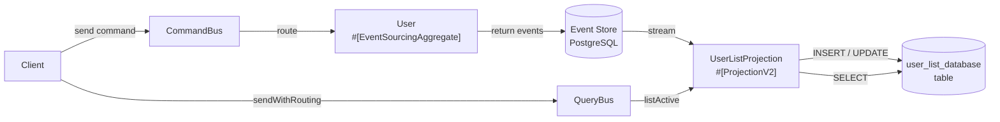
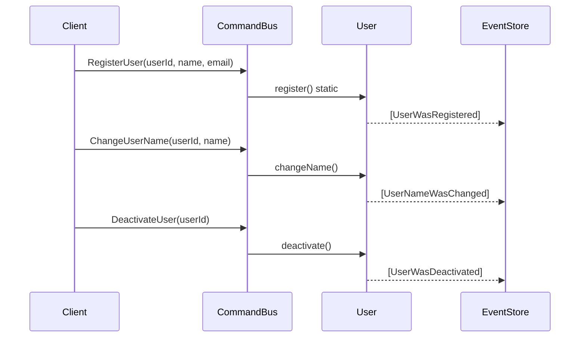
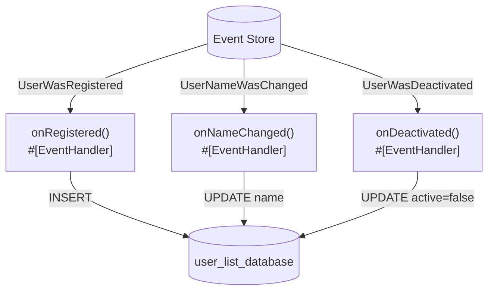
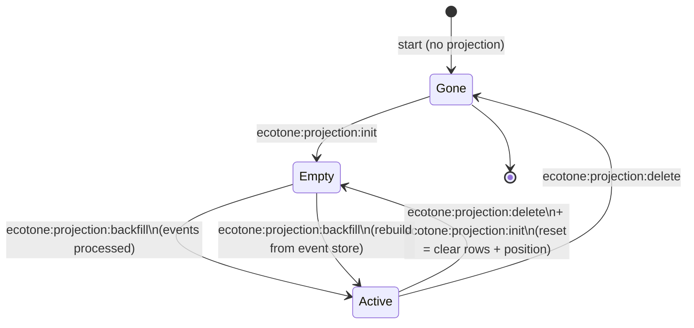

# Laravel Projection — Database Read Model

## 1. What you'll learn

This example shows how to build a **projection** (a read-optimised view) on top of an event-sourced `User` aggregate using Laravel and Ecotone. You will see how the projection's `#[ProjectionInitialization]` hook creates the storage, how `#[EventHandler]` methods react to each domain event, and how the full projection lifecycle (init → query → reset → backfill → delete) lets you rebuild the read model from scratch whenever you need to.

## 2. The problem this solves

In a traditional application, if you need a new view on your data — say "all active users ordered by name" — you run a database migration and populate the new table. In an event-sourced system you still have every domain event ever emitted. You can **replay** them into any new shape without touching the write side. This is the projection pattern: the events are the truth; the read model is just a cache you can always discard and rebuild.

## 3. How it fits together



*Files involved:*
- `app/Domain/User.php` — aggregate that produces the events
- `app/Domain/Event/` — `UserWasRegistered`, `UserNameWasChanged`, `UserWasDeactivated`
- `app/ReadModel/UserListProjection.php` — projection that maintains `user_list_database`
- `app/Infrastructure/EcotoneConfiguration.php` — wires the PostgreSQL connection

## 4. Walkthrough of the code

### 4.1 Domain — User aggregate



The `User` aggregate is annotated with `#[EventSourcingAggregate]`. Command handlers are `static` for creation (`register`) and instance methods for mutations (`changeName`, `deactivate`). Each handler returns an array of events. `#[EventSourcingHandler]` methods reconstruct aggregate state from stored events — they must have no side effects.

Each event class is annotated with `#[NamedEvent('user.was_registered')]` (and so on). The name is what Ecotone stores alongside the event payload, so the recorded stream stays readable even if you later move or rename the PHP class. Without `#[NamedEvent]`, the fully-qualified class name is used — which couples your stored events to your namespace. For any event you intend to keep on disk, give it a stable name.

### 4.2 The projection — direct database writes



`UserListProjection` receives a `ConnectionInterface` (Laravel's default DB connection) injected by Ecotone's container. Each `#[EventHandler]` method writes directly to the `user_list_database` table. No DTO wiring, no intermediate services — this is the simplest possible pattern.

### 4.3 Lifecycle hooks

| Hook | Attribute | What it does |
|------|-----------|--------------|
| Initialise | `#[ProjectionInitialization]` | `CREATE TABLE IF NOT EXISTS user_list_database (...)` |
| Delete | `#[ProjectionDelete]` | `DROP TABLE IF EXISTS user_list_database` |

Resetting the projection is done by deleting and re-initialising it, which clears both the read model table and Ecotone's stored stream position for this projection. A subsequent backfill replays all events from position 0.

### 4.4 Querying the read model

The `#[QueryHandler('user.listActive')]` method runs a simple `SELECT` via the `ConnectionInterface` and returns an array. Callers use the query bus:

```php
$rows = $queryBus->sendWithRouting('user.listActive');
// $rows[0]['name'] === 'Alice Cooper'
```

The query handler lives on the same class as the event handlers. You can move it to a separate class if you want read/write separation at the class level.

## 5. Running it

```bash
# Start services
docker compose up -d app database

# Enter the container
docker compose exec app bash

# Install and run
cd quickstart-examples/Laravel/Projection/DatabaseReadModel
composer update
php run_example.php
```

The script exits 0 and prints a seven-step ribbon showing each lifecycle phase.

> **PostgreSQL only.** Event sourcing requires PostgreSQL; SQLite is not supported.

## 6. Reset vs Delete vs Rebuild



| Command | Effect |
|---------|--------|
| `ecotone:projection:init` | Calls `#[ProjectionInitialization]`, records projection as known |
| `ecotone:projection:delete` | Calls `#[ProjectionDelete]`, removes projection tracking |
| `ecotone:projection:backfill` | Replays all events from the event store into the projection |

**Reset = delete + re-init.** This two-step approach makes the state transitions explicit: you see the table disappear, then reappear empty, then fill up during backfill.

## 7. When to choose this pattern

Use `DatabaseReadModel` when:
- You want the simplest possible implementation
- Your read model logic is straightforward SQL
- You don't need Eloquent features (observers, mutators, scopes)

See [EloquentReadModel](../EloquentReadModel/README.md) when you want to use Eloquent's ORM features in your read model writers.

## 8. Common pitfalls

1. **Forgetting `CREATE TABLE IF NOT EXISTS`.** Without `IF NOT EXISTS` the `init` hook fails if the table already exists, for example after a partial run.
2. **Querying before init.** If you call `user.listActive` before `ecotone:projection:init` the table does not exist and you get a DB error. Always initialise before querying.
3. **Event store accumulates across runs.** This example cleans up the User aggregate stream at the start of `run_example.php`. In production you would never delete the event stream — that is your source of truth.
4. **PostgreSQL only.** The Ecotone event store uses Prooph's PostgreSQL adapter. MySQL is supported via a different adapter but requires explicit configuration.
5. **Projection name collisions.** The name `user_list_database` is unique to this example. If you run both examples simultaneously they write to separate tables and use separate projection tracking entries.
