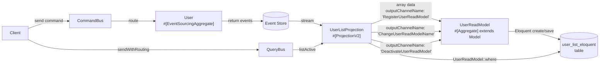
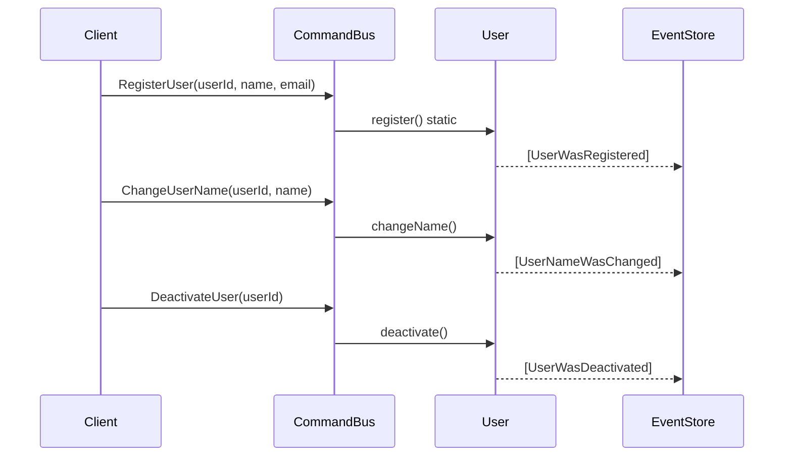
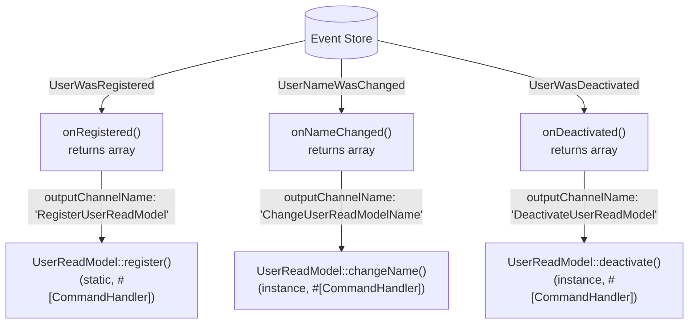

# Laravel Projection — Eloquent Read Model

## 1. What you'll learn

This example shows how to drive an Eloquent read model through Ecotone's stateful aggregate machinery. The projection's `#[EventHandler]` methods translate domain events into plain arrays and route them via `outputChannelName` to string-keyed `#[CommandHandler]` methods on `UserReadModel` — a `#[Aggregate]` that **is** an Eloquent `Model`. Ecotone auto-loads the aggregate by identifier and auto-saves it after the handler returns, so you get exactly the "load + mutate + save" sugar that stateful aggregates provide, applied to a read model. No DTO classes needed.

## 2. The problem this solves

When you rebuild a read model from an event stream, you often want each event to land on a record that goes through your normal Eloquent lifecycle — observers, mutators, casts, the lot. Writing raw SQL in the projection bypasses all of that. By making the read model a stateful Eloquent aggregate, every event becomes a command on the aggregate, and Eloquent handles the rest.

## 3. How it fits together



*Files involved:*
- `app/Domain/User.php` — the write-side event-sourced aggregate
- `app/ReadModel/UserListProjection.php` — translates events into row arrays and routes them
- `app/ReadModel/UserReadModel.php` — `#[Aggregate]` Eloquent model with string-routed command handlers

## 4. Walkthrough of the code

### 4.1 Domain — User aggregate



Identical to the DatabaseReadModel domain. The write side is shared; only the read side differs.

Each event class is annotated with `#[NamedEvent('user.was_registered')]` (and so on). The name is what Ecotone stores alongside the event payload, so the recorded stream stays readable even if you later move or rename the PHP class. Without `#[NamedEvent]`, the fully-qualified class name is used — which couples your stored events to your namespace. For any event you intend to keep on disk, give it a stable name.

### 4.2 The projection — event-to-array translation



Each `#[EventHandler]` on `UserListProjection` returns a plain associative array of the row data and declares `outputChannelName: 'RegisterUserReadModel'` (etc.). Ecotone hands that array to the matching `#[CommandHandler]` on `UserReadModel` by string routing key. No DTO classes are needed; the array travels straight from the projection to the aggregate.

> **Arrays are not the only option.** You can return a typed command class instead — e.g. `RegisterUserReadModel` with a `public string $userId` property. The aggregate's command handler then type-hints that class instead of `array $data`, and identifier resolution uses dot syntax (`payload.userId`) on instance handlers. Use a class when you want named fields, IDE autocompletion, and static analysis on the payload shape. Use an array when you want to keep things dependency-free and skip a DTO class per channel. Both reach the same `#[CommandHandler]`.

```php
#[EventHandler(outputChannelName: 'RegisterUserReadModel')]
public function onRegistered(UserWasRegistered $event): array
{
    return [
        'user_id' => $event->userId,
        'name' => $event->name,
        'email' => $event->email,
        'active' => true,
    ];
}
```

### 4.3 The read model is a stateful Eloquent aggregate

```php
#[Aggregate]
final class UserReadModel extends Model
{
    public $table = 'user_list_eloquent';
    public $primaryKey = 'user_id';
    public $incrementing = false;
    public $keyType = 'string';
    public $timestamps = false;
    public $fillable = ['user_id', 'name', 'email', 'active'];

    #[AggregateIdentifierMethod('user_id')]
    public function getUserId(): string { return $this->user_id; }

    #[CommandHandler('RegisterUserReadModel')]
    public static function register(array $data): self
    {
        return self::create($data);
    }

    #[CommandHandler('ChangeUserReadModelName', identifierMapping: ['user_id' => "payload['user_id']"])]
    public function changeName(array $data): void
    {
        $this->name = $data['name'];
    }
}
```

Three things make this work end-to-end:

- **`#[Aggregate]` + `extends Model`** — Ecotone detects an Eloquent aggregate and wires its `EloquentRepository` automatically. No repository configuration needed.
- **`#[AggregateIdentifierMethod('user_id')]`** — declares which Eloquent column identifies the aggregate. Ecotone uses this to load the model from the DB before invoking instance command handlers, and to persist it afterwards.
- **`identifierMapping: ['user_id' => "payload['user_id']"]`** — tells Ecotone where to find the identifier *in the inbound payload*. The expression `payload['user_id']` reads the `user_id` key of the array. The static `register` handler doesn't need it — it creates a new aggregate, so there's nothing to load first.

After the handler returns, Ecotone calls `$model->save()` for you. That's the "auto-load + auto-save" sugar applied to a read model.

### 4.4 Lifecycle hooks

| Hook | Attribute | What it does |
|------|-----------|--------------|
| Initialise | `#[ProjectionInitialization]` | `CREATE TABLE IF NOT EXISTS user_list_eloquent (...)` |
| Delete | `#[ProjectionDelete]` | `DROP TABLE IF EXISTS user_list_eloquent` |

Both hooks use raw SQL via `ConnectionInterface` for reliable table management regardless of Eloquent's migration state.

### 4.5 Querying the read model

The `#[QueryHandler('user.listActive')]` method uses Eloquent's fluent API directly:

```php
#[QueryHandler('user.listActive')]
public function listActive(): array
{
    return UserReadModel::where('active', true)
        ->orderBy('name')
        ->get()
        ->toArray();
}
```

Callers use the query bus identically to the DatabaseReadModel example:

```php
$rows = $queryBus->sendWithRouting('user.listActive');
// $rows[0]['name'] === 'Alice Cooper'
```

## 5. Running it

```bash
docker compose up -d app database
docker compose exec app bash
cd quickstart-examples/Laravel/Projection/EloquentReadModel
composer update
php run_example.php
```

## 6. Reset vs Delete vs Rebuild


| Command | Effect |
|---------|--------|
| `ecotone:projection:init` | Calls `#[ProjectionInitialization]`, records projection as known |
| `ecotone:projection:delete` | Calls `#[ProjectionDelete]`, removes projection tracking |
| `ecotone:projection:backfill` | Replays all events; each event flows through the outputChannelName chain and lands on a `UserReadModel` aggregate |

During backfill the full chain runs: event → projection handler returns command → Ecotone routes command to `UserReadModel` → Eloquent loads/creates the row, applies the change, saves. Eloquent observers fire normally throughout.

## 7. When to choose this pattern

Use `EloquentReadModel` when:
- You want Eloquent's lifecycle hooks (observers, mutators, casts) on your read model
- You want the "auto-load + auto-save" experience on the read side, the same way stateful aggregates work on the write side
- Your team is more comfortable with Eloquent than raw SQL

See [DatabaseReadModel](../DatabaseReadModel/README.md) for the simpler direct-write pattern.

## 8. Common pitfalls

1. **`outputChannelName` must match a `#[CommandHandler]` routing key string exactly.** A typo causes a silent "no handler found" failure. Consider extracting the strings to constants if you have many.
2. **`identifierMapping` is required on instance command handlers.** Without it Ecotone can't extract the aggregate id from the inbound payload (chaining via `outputChannelName` bypasses bus-level identifier extraction). Static creation handlers don't need it. For arrays use bracket syntax: `"payload['user_id']"`.
3. **`$fillable` must include all columns.** Eloquent's mass-assignment protection blocks fields not listed.
4. **`$incrementing = false` and `$keyType = 'string'` are required.** Without them Eloquent treats the UUID primary key as an auto-increment integer.
5. **`$timestamps = false`.** The table has no `created_at`/`updated_at` columns; leaving timestamps enabled will throw.
