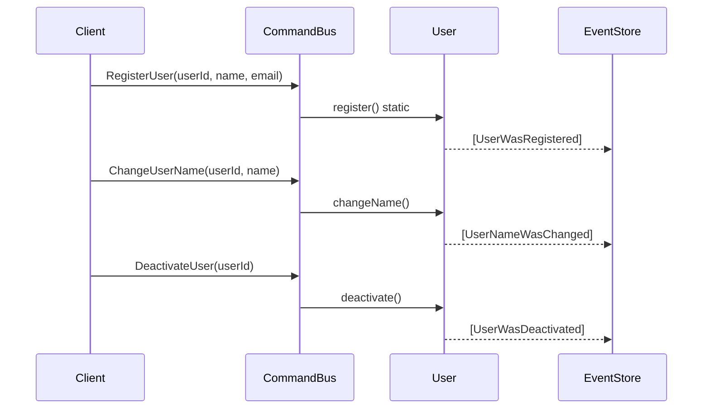
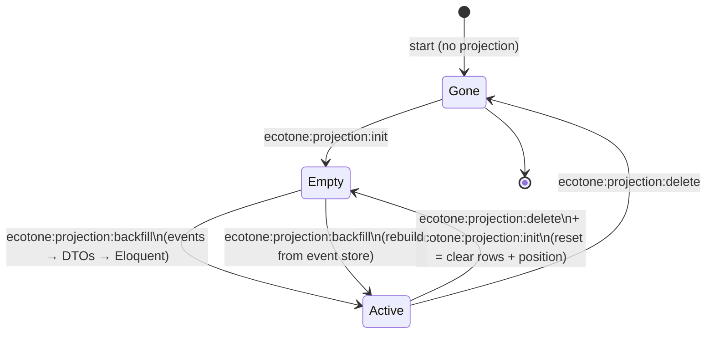

# Laravel Projection — Eloquent Read Model

## 1. What you'll learn

This example extends the [DatabaseReadModel](../DatabaseReadModel/README.md) pattern by routing projection events through named channels to a dedicated `UserReadModelWriter` service that uses Eloquent to persist the read model. You will see how `outputChannelName` on `#[EventHandler]` decouples the projection class from persistence concerns, enabling Eloquent observers, mutators, and scopes on the read model.

## 2. The problem this solves

Sometimes you want your read model to be a proper Eloquent model — so it benefits from automatic timestamps, attribute casting, model observers, or serialisation helpers. Projections can emit DTO messages to named channels instead of writing directly to the database. A separate handler class receives those DTOs and calls Eloquent. This separates the event-to-DTO mapping (projection) from the DTO-to-Eloquent persistence (writer).

## 3. How it fits together

```mermaid
flowchart LR
    Client -->|send command| CommandBus
    CommandBus -->|route| User["User\n#[EventSourcingAggregate]"]
    User -->|return events| EventStore[(Event Store\nPostgreSQL)]
    EventStore -->|stream| Projection["UserListProjection\n#[ProjectionV2]"]
    Projection -->|ApplyUserRegistered DTO\noutputChannelName| Channel1["user_read_model\n.apply_registered"]
    Projection -->|ApplyUserNameChanged DTO\noutputChannelName| Channel2["user_read_model\n.apply_name_changed"]
    Projection -->|ApplyUserDeactivated DTO\noutputChannelName| Channel3["user_read_model\n.apply_deactivated"]
    Channel1 -->|#[InternalHandler]| Writer["UserReadModelWriter"]
    Channel2 --> Writer
    Channel3 --> Writer
    Writer -->|create / update| Eloquent["UserReadModel\n(Eloquent)"]
    Eloquent -->|persist| ReadModel[(user_list_eloquent\ntable)]
    Client -->|sendWithRouting| QueryBus
    QueryBus -->|listActive| Projection
    Projection -->|UserReadModel::where| Eloquent
```

*Files involved:*
- `app/Domain/User.php` — aggregate
- `app/ReadModel/UserListProjection.php` — maps events to DTOs via `outputChannelName`
- `app/Application/Apply*.php` — DTO classes
- `app/Application/UserReadModelWriter.php` — `#[InternalHandler]` persists via Eloquent
- `app/Models/UserReadModel.php` — Eloquent model for `user_list_eloquent`

## 4. Walkthrough of the code

### 4.1 Domain — User aggregate



Identical to the DatabaseReadModel domain. The write side is shared; only the read side differs.

Each event class is annotated with `#[NamedEvent('user.was_registered')]` (and so on). The name is what Ecotone stores alongside the event payload, so the recorded stream stays readable even if you later move or rename the PHP class. Without `#[NamedEvent]`, the fully-qualified class name is used — which couples your stored events to your namespace. For any event you intend to keep on disk, give it a stable name.

### 4.2 The projection — outputChannelName routing

```mermaid
flowchart TD
    ES[(Event Store)] -->|UserWasRegistered| P1["onRegistered()\nreturns ApplyUserRegistered"]
    ES -->|UserNameWasChanged| P2["onNameChanged()\nreturns ApplyUserNameChanged"]
    ES -->|UserWasDeactivated| P3["onDeactivated()\nreturns ApplyUserDeactivated"]
    P1 -->|outputChannelName| CH1["user_read_model.apply_registered"]
    P2 -->|outputChannelName| CH2["user_read_model.apply_name_changed"]
    P3 -->|outputChannelName| CH3["user_read_model.apply_deactivated"]
    CH1 -->|#[InternalHandler]| W1["applyRegistered()\nUserReadModel::create()"]
    CH2 -->|#[InternalHandler]| W2["applyNameChanged()\nUserReadModel::update()"]
    CH3 -->|#[InternalHandler]| W3["applyDeactivated()\nUserReadModel::update()"]
```

Each `#[EventHandler]` on `UserListProjection` returns a typed DTO and declares an `outputChannelName`. Ecotone delivers the DTO to the matching `#[InternalHandler]` on `UserReadModelWriter`. The writer calls Eloquent's `create()` and `update()` — standard Eloquent, full lifecycle hooks available.

### 4.3 Lifecycle hooks

| Hook | Attribute | What it does |
|------|-----------|--------------|
| Initialise | `#[ProjectionInitialization]` | `CREATE TABLE IF NOT EXISTS user_list_eloquent (...)` |
| Delete | `#[ProjectionDelete]` | `DROP TABLE IF EXISTS user_list_eloquent` |

Both hooks use raw SQL via `ConnectionInterface` for reliable table management regardless of Eloquent's migration state.

### 4.4 Querying the read model

The `#[QueryHandler('user.listActive')]` method uses Eloquent's fluent API directly:

```php
#[QueryHandler('user.listActive')]
public function listActive(): array
{
    return UserReadModel::where('active', true)
        ->orderBy('name')
        ->get()
        ->toArray();
}
```

Callers use the query bus identically to the DatabaseReadModel example:

```php
$rows = $queryBus->sendWithRouting('user.listActive');
// $rows[0]['name'] === 'Alice Cooper'
```

## 5. Running it

```bash
# Start services
docker compose up -d app database

# Enter the container
docker compose exec app bash

# Install and run
cd quickstart-examples/Laravel/Projection/EloquentReadModel
composer update
php run_example.php
```

## 6. Reset vs Delete vs Rebuild



| Command | Effect |
|---------|--------|
| `ecotone:projection:init` | Calls `#[ProjectionInitialization]`, records projection as known |
| `ecotone:projection:delete` | Calls `#[ProjectionDelete]`, removes projection tracking |
| `ecotone:projection:backfill` | Replays all events; each event flows through the outputChannelName chain into Eloquent |

During backfill the full chain runs: event → projection handler returns DTO → Ecotone routes DTO to `InternalHandler` → Eloquent persists. Eloquent model observers fire normally during backfill.

## 7. When to choose this pattern

Use `EloquentReadModel` when:
- You want Eloquent's lifecycle hooks (observers, mutators, casts) on your read model
- Your team is more comfortable with Eloquent than raw SQL
- You want to leverage Eloquent's scopes for querying

See [DatabaseReadModel](../DatabaseReadModel/README.md) for the simpler direct-write pattern.

## 8. Common pitfalls

1. **outputChannelName typos.** The channel name in `#[EventHandler(outputChannelName: '...')]` must match the `inputChannelName` in `#[InternalHandler(inputChannelName: '...')]` exactly. A mismatch causes a silent failure where no handler runs.
2. **`$fillable` must include all columns.** Eloquent's mass-assignment protection blocks fields not listed in `$fillable`. The `UserReadModel` lists `user_id`, `name`, `email`, `active`.
3. **`$incrementing = false` is required.** Without this Eloquent tries to cast the string UUID primary key to an integer after insert, producing a wrong key.
4. **`$timestamps = false`.** The `user_list_eloquent` table has no `created_at`/`updated_at` columns. Eloquent will throw if you leave timestamps enabled and the columns are missing.
5. **Schema facade in init hook.** This example uses raw SQL in `#[ProjectionInitialization]` for reliability. The Schema facade requires the application to be fully booted, which is guaranteed when Ecotone runs commands, but raw SQL is simpler and avoids blueprint/migration overhead in quickstart code.
