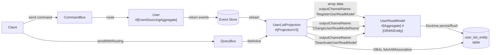
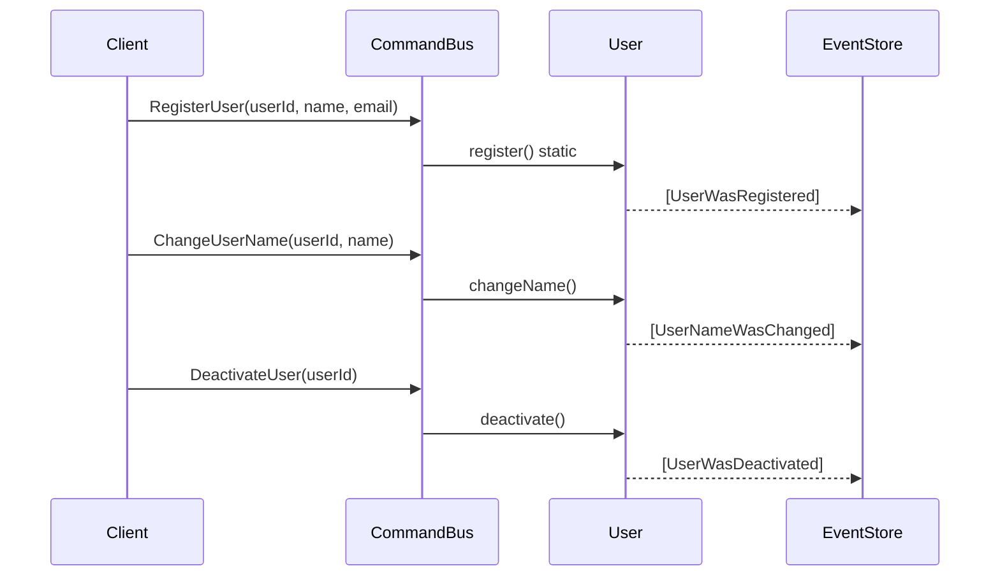
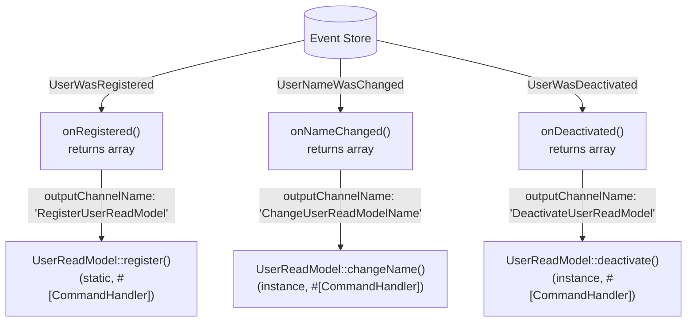
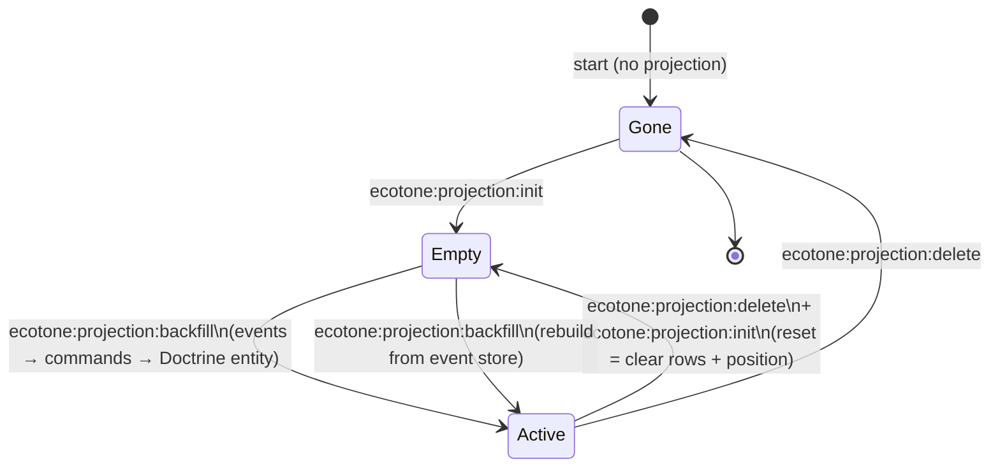

# Symfony Projection — Entity Read Model

## 1. What you'll learn

This example shows how to drive a Doctrine ORM read model through Ecotone's stateful aggregate machinery. The projection's `#[EventHandler]` methods translate domain events into plain arrays and route them via `outputChannelName` to string-keyed `#[CommandHandler]` methods on `UserReadModel` — a `#[Aggregate]` that **is** a Doctrine ORM entity. Ecotone auto-loads the aggregate by identifier and auto-saves it after the handler returns, so you get exactly the "load + mutate + save" sugar that stateful aggregates provide, applied to a read model. No DTO classes needed.

## 2. The problem this solves

When you rebuild a read model from an event stream, you often want each event to land on a record that goes through your normal persistence layer — lifecycle callbacks, repositories, the entity manager. Writing raw SQL in the projection bypasses all of that. By making the read model a stateful Doctrine entity aggregate, every event becomes a command on the aggregate, and Doctrine handles the rest.

## 3. How it fits together



*Files involved:*
- `src/Domain/User.php` — the write-side event-sourced aggregate
- `src/ReadModel/UserListProjection.php` — translates events into row arrays and routes them
- `src/ReadModel/UserReadModel.php` — `#[Aggregate]` `#[ORM\Entity]` with string-routed command handlers

## 4. Walkthrough of the code

### 4.1 Domain — User aggregate



Identical to the DatabaseReadModel domain. The write side is shared; only the read side differs.

Each event class is annotated with `#[NamedEvent('user.was_registered')]` (and so on). The name is what Ecotone stores alongside the event payload, so the recorded stream stays readable even if you later move or rename the PHP class.

### 4.2 The projection — event-to-array translation



Each `#[EventHandler]` on `UserListProjection` returns a plain associative array of the row data and declares `outputChannelName: 'RegisterUserReadModel'` (etc.). Ecotone hands that array to the matching `#[CommandHandler]` on `UserReadModel` by string routing key. No DTO classes are needed; the array travels straight from the projection to the aggregate.

```php
#[EventHandler(outputChannelName: 'RegisterUserReadModel')]
public function onRegistered(UserWasRegistered $event): array
{
    return [
        'userId' => $event->userId,
        'name' => $event->name,
        'email' => $event->email,
        'active' => true,
    ];
}
```

The array key `'userId'` matches the PHP property name on the aggregate (`$userId`), so Ecotone auto-resolves the identifier on instance command handlers — no `identifierMapping` needed.

### 4.3 The read model is a stateful Doctrine entity aggregate

```php
#[ORM\Entity]
#[ORM\Table(name: 'user_list_entity')]
#[Aggregate]
final class UserReadModel
{
    #[ORM\Id]
    #[ORM\Column(name: 'user_id', type: 'string', length: 36)]
    #[Identifier]
    private string $userId;

    #[CommandHandler('RegisterUserReadModel')]
    public static function register(array $data): self
    {
        return new self($data['userId'], $data['name'], $data['email'], $data['active']);
    }

    #[CommandHandler('ChangeUserReadModelName')]
    public function changeName(array $data): void
    {
        $this->name = $data['name'];
    }
}
```

Two things make this work end-to-end:

- **`#[ORM\Entity]` + `#[Aggregate]`** — Ecotone detects a Doctrine ORM aggregate and wires its Doctrine repository automatically. No repository configuration needed.
- **`#[Identifier]` on the id property** — declares which property identifies the aggregate. Ecotone uses this to load the entity from the DB before invoking instance command handlers, and to persist it afterwards. Because the projection emits an array whose key (`'userId'`) matches this property name, Ecotone resolves the identifier without an explicit `identifierMapping`.

After the handler returns, Ecotone calls the entity manager's persist and flush for you. That's the "auto-load + auto-save" sugar applied to a read model.

### 4.4 Lifecycle hooks

| Hook | Attribute | What it does |
|------|-----------|--------------|
| Initialise | `#[ProjectionInitialization]` | `CREATE TABLE IF NOT EXISTS user_list_entity (...)` |
| Delete | `#[ProjectionDelete]` | `DROP TABLE IF EXISTS user_list_entity` |

Both hooks use raw SQL via Doctrine DBAL `Connection` for reliable table management regardless of the ORM's schema tool state.

### 4.5 Querying the read model

The `#[QueryHandler('user.listActive')]` method uses Doctrine DBAL's `fetchAllAssociative` directly:

```php
#[QueryHandler('user.listActive')]
public function listActive(): array
{
    return $this->connection->fetchAllAssociative(
        'SELECT user_id, name, email, active FROM user_list_entity WHERE active = TRUE ORDER BY name ASC',
    );
}
```

Callers use the query bus identically to the DatabaseReadModel example:

```php
$rows = $queryBus->sendWithRouting('user.listActive');
// $rows[0]['name'] === 'Alice Cooper'
```

## 5. Running it

```bash
docker compose up -d app database
docker compose exec app bash
cd quickstart-examples/Symfony/Projection/EntityReadModel
composer update
php run_example.php
```

## 6. Reset vs Delete vs Rebuild



| Command | Effect |
|---------|--------|
| `ecotone:projection:init` | Calls `#[ProjectionInitialization]`, records projection as known |
| `ecotone:projection:delete` | Calls `#[ProjectionDelete]`, removes projection tracking |
| `ecotone:projection:backfill` | Replays all events; each event flows through the outputChannelName chain and lands on a `UserReadModel` aggregate |

During backfill the full chain runs: event → projection handler returns command → Ecotone routes command to `UserReadModel` → Doctrine loads/creates the entity, applies the change, persists and flushes.

## 7. When to choose this pattern

Use `EntityReadModel` when:
- You want Doctrine ORM lifecycle callbacks on your read model entities
- You want the "auto-load + auto-save" experience on the read side, the same way stateful aggregates work on the write side
- Your team is more comfortable with Doctrine ORM than raw SQL

See [DatabaseReadModel](../DatabaseReadModel/README.md) for the simpler direct-write pattern.

## 8. Common pitfalls

1. **`outputChannelName` must match a `#[CommandHandler]` routing key string exactly.** A typo causes a silent "no handler found" failure. Consider extracting the strings to constants if you have many.
2. **Match the payload key to the aggregate's PHP property name** to skip `identifierMapping`. The projection emits arrays keyed `userId` and the aggregate property is `$userId`, so Ecotone resolves the identifier automatically. If the payload key differs (e.g. `user_id`), an explicit `identifierMapping: ['userId' => "payload['user_id']"]` is required on instance command handlers (chaining via `outputChannelName` bypasses bus-level identifier extraction). Static creation handlers don't need either.
3. **`withDoctrineORMRepositories(true)` is required.** Without it Ecotone doesn't wire the Doctrine entity manager as the aggregate repository.
4. **`#[Identifier]` goes on the property, not the getter.** For Doctrine entities, use the property-based `#[Identifier]` attribute — not `#[AggregateIdentifierMethod]` which is for Eloquent models with dynamic accessors.
5. **ORM mapping must point at `src/ReadModel`.** The `doctrine.yaml` maps only `App\ReadModel` to avoid scanning event-sourced domain classes (which are not entities).
