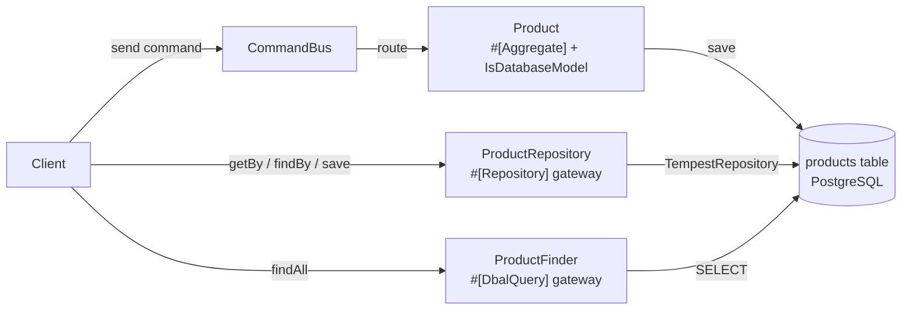

# Tempest Model — Active-Record Model as an Ecotone Aggregate

## 1. What you'll learn

This example shows how a **Tempest active-record model** (`use Tempest\Database\IsDatabaseModel`) becomes an **Ecotone `#[Aggregate]`**. The model carries its own `#[CommandHandler]` and `#[QueryHandler]` methods, and Ecotone persists it automatically through the `ecotone/tempest` package's `TempestRepository` (a `StandardRepository` that calls the model's own `save()`).

The same aggregate is then exercised three ways:

1. **Command Bus calling the model directly** — commands route to the model's handlers; persistence is automatic.
2. **`#[Repository]` business interface** — an Ecotone gateway that loads (and saves) the aggregate.
3. **`#[DbalQuery]` business interface** — an SQL read-side gateway over the underlying table.

## 2. How it fits together



*Files involved:*
- `app/Domain/Product.php` — the Tempest model annotated with `#[Aggregate]`
- `app/Domain/Command/RegisterProduct.php`, `ChangePrice.php` — command messages
- `app/ProductRepository.php` — `#[Repository]` business-interface gateway (load + save)
- `app/ProductFinder.php` — `#[DbalQuery]` read-side business interface
- `app/Infrastructure/EcotoneConfiguration.php` — registers Tempest's `DatabaseConfig` as Ecotone's default `DbalConnectionFactory`
- `app/Infrastructure/ConnectionFactoryInitializer.php` — exposes the same DBAL connection to Tempest autowiring
- `app/database.config.php` — the Tempest `PostgresConfig`

## 3. The model as an aggregate

```php
#[Aggregate]
final class Product
{
    use IsDatabaseModel;

    public PrimaryKey $id;
    public string $name;
    public int $price;

    #[CommandHandler]
    public static function register(RegisterProduct $command): self { /* new self(); ...; $product->save(); */ }

    #[CommandHandler(routingKey: 'product.changePrice')]
    public function changePrice(ChangePrice $command): void { $this->price = $command->price; }

    #[QueryHandler('product.getPrice')]
    public function getPrice(): int { return $this->price; }

    #[IdentifierMethod('id')]
    public function getId(): int { return $this->id->value; }
}
```

- The **static** handler is the factory: it creates the row (and calls `save()` so the generated id is returned to the caller).
- The **instance** handler mutates state; `TempestRepository::save()` persists it after the handler returns — no explicit `save()` needed.
- `#[IdentifierMethod('id')]` maps Ecotone's aggregate identifier to the Tempest `PrimaryKey`'s int `value`, so commands/queries target the right row via `metadata: ['aggregate.id' => $id]`.

## 4. Identifier mapping and table setup

Ecotone needs a scalar identifier, but the model's identity is a `Tempest\Database\PrimaryKey` object. `#[IdentifierMethod('id')] getId(): int` exposes the underlying int. Loading uses `TempestRepository::findBy()` → `Product::findById($id)`.

The `products` table is created in `run_example.php` with Tempest's own schema builder (`CreateTableStatement`), matching how the package's integration test sets up its `orders` table — dropped first for idempotency:

```php
$createSql = (new CreateTableStatement('products'))
    ->primary('id')->string('name')->integer('price')
    ->compile($database->dialect);
```

## 5. Running it

```bash
docker compose up -d app database
docker compose exec app bash -lc 'cd quickstart-examples/Tempest/Model && composer update && php run_example.php'
```

The script prints a six-step ribbon ending with `== Example completed successfully ==`.

## 6. Tempest-specific wiring

1. `app/database.config.php` returns a Tempest `PostgresConfig`, auto-discovered as the container's `DatabaseConfig`.
2. `EcotoneConfiguration::databaseConnection()` returns `TempestConnectionReference::defaultConnection()`, registering that config as Ecotone's default `DbalConnectionFactory` (used by the DBAL business interface).
3. `ConnectionFactoryInitializer` resolves `Interop\Queue\ConnectionFactory` to the same Ecotone `DbalConnectionFactory`, so any Tempest-autowired service shares one connection.

Handlers, the aggregate and the business interfaces are discovered automatically from the `App\` PSR-4 root — **no `ecotone.config.php` is required** (zero-config).

> Boot order note: resolve `ConfiguredMessagingSystem` once right after `Tempest::boot()` before fetching the buses/gateways. That call compiles Ecotone's services and registers them with Tempest's container so `#[Repository]`/`#[DbalQuery]` gateways and the buses become resolvable via `$container->get(...)`.

## 7. The three demonstrations

| # | Mechanism | What it proves |
|---|-----------|----------------|
| 2-4 | Command/Query Bus → model | `RegisterProduct` creates and persists; `product.changePrice` mutates by `aggregate.id`; `product.getPrice` reads reconstituted state |
| 5 | `#[Repository]` gateway | `getBy(int)` / `findBy(int)` load the model; `save(Product)` persists an **already-loaded** aggregate (UPDATE) |
| 6 | `#[DbalQuery]` gateway | `findAll()` reads the underlying `products` table with raw SQL |

## 8. Known limitation (active-record + `#[Repository]` save)

The `#[Repository]` `save(Product $product)` gateway works for **existing** aggregates (their `PrimaryKey` is set, so `getId()` resolves). It does **not** work for a brand-new, unsaved `Product`: Ecotone reads the aggregate identifier via `getId()` before persisting, but Tempest only generates the `PrimaryKey` during the INSERT, so `getId()` throws "must not be accessed before initialization". Create new aggregates through the Command Bus path (the static `#[CommandHandler]` factory) — that returns the generated id — and use the repository gateway for loads and updates.
