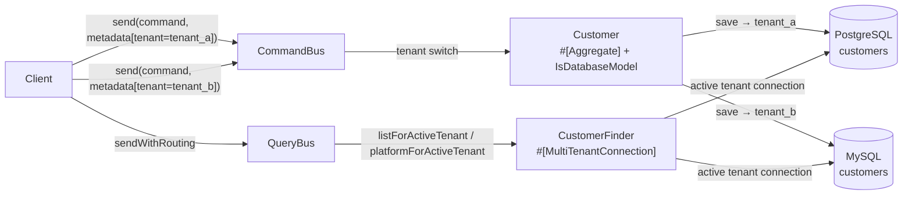

# Tempest Multi-Tenant — One Aggregate, Two Databases

## 1. What you'll learn

This example shows how Ecotone routes a single **Tempest active-record aggregate** to
**different physical databases per tenant**, chosen at runtime from a message header. Two
tenants are wired to two separate database engines:

- `tenant_a` → PostgreSQL (`database`)
- `tenant_b` → MySQL (`database-mysql`)

The same `Customer` aggregate, the same command, the same handler — only
`metadata: ['tenant' => '...']` decides where the row lands. The example then proves, from
inside a query handler, that each tenant's `#[MultiTenantConnection]` really points at its
own engine, and that neither tenant can see the other's data.

## 2. How it fits together



*Files involved:*
- `app/Domain/Customer.php` — the Tempest model annotated with `#[Aggregate]` and a `#[Uuid]` id
- `app/Domain/Command/RegisterCustomer.php` — the command message
- `app/ReadModel/CustomerFinder.php` — query handlers that receive the active tenant's connection
- `app/Infrastructure/EcotoneConfiguration.php` — the `MultiTenantConfiguration` mapping
- `app/tenant_a.config.php`, `app/tenant_b.config.php` — the two tagged Tempest database configs

## 3. The aggregate

```php
#[Aggregate]
#[Table('customers')]
final class Customer
{
    use IsDatabaseModel;

    #[Uuid]
    public PrimaryKey $id;

    public string $name;

    #[CommandHandler]
    public static function register(RegisterCustomer $command): self
    {
        $customer = new self();
        $customer->name = $command->name;
        $customer->save();

        return $customer;
    }

    #[IdentifierMethod('id')]
    public function getId(): string { return (string) $this->id->value; }
}
```

- `#[Uuid] PrimaryKey $id` makes Tempest generate a **UUID v7 at insert time**, so the schema
  is identical on PostgreSQL and MySQL (`id VARCHAR(36) PRIMARY KEY`) — no per-engine
  auto-increment column. The generated id is returned from the register handler.
- `save()` persists through `TempestRepository`. Because a tenant is active for the duration
  of the command, the write lands in that tenant's database (see section 5).

## 4. Choosing the tenant per message

```php
#[ServiceContext]
public function multiTenantConfiguration(): MultiTenantConfiguration
{
    return MultiTenantConfiguration::create(
        tenantHeaderName: 'tenant',
        tenantToConnectionMapping: [
            'tenant_a' => TempestConnectionReference::create('tenant_a'),
            'tenant_b' => TempestConnectionReference::create('tenant_b'),
        ],
    );
}
```

Each tenant maps to a **tagged** Tempest config, auto-discovered from `*.config.php`:

```php
// app/tenant_a.config.php
return new PostgresConfig(host: 'database', ..., tag: 'tenant_a');

// app/tenant_b.config.php
return new MysqlConfig(host: 'database-mysql', ..., tag: 'tenant_b');
```

Sending a command with `metadata: ['tenant' => 'tenant_a']` activates that tenant for the
whole message, then deactivates it afterwards.

## 5. How the tenant switch reaches the Tempest ORM

When Ecotone activates a tenant it promotes that tenant's connection as Tempest's **default**
connection (via `TempestTenantDatabaseSwitcher`), and rebuilds the default `Database` from it.
That is what makes `IsDatabaseModel::save()` — and therefore the aggregate — write to the
active tenant's database rather than to Tempest's discovered default. The same promoted
connection backs Ecotone's DBAL, so a single PDO serves both the ORM write and the
surrounding transaction.

## 6. Proving the routing with `#[MultiTenantConnection]`

`CustomerFinder` does not hardcode a connection. Each query handler receives the **active
tenant's** Doctrine connection through the attribute:

```php
#[QueryHandler('customer.platformForActiveTenant')]
public function platformForActiveTenant(#[MultiTenantConnection] Connection $connection): string
{
    return $connection->getDatabasePlatform()::class;
}
```

`run_example.php` uses this to assert that the connection handed to the `tenant_a` query is a
PostgreSQL platform and the `tenant_b` query is a MySQL platform — direct proof that the
attribute resolves to the correct physical database. It then lists each tenant's customers and
asserts the two sets are disjoint.

## 7. Running it

```bash
docker compose up -d app database database-mysql
docker compose exec app bash -lc 'cd quickstart-examples/Tempest/MultiTenant/MessageBus && composer update && php run_example.php'
```

The script prints a four-step ribbon ending with `== Example completed successfully ==`:

```
tenant_a -> Doctrine\DBAL\Platforms\PostgreSQL120Platform
tenant_b -> Doctrine\DBAL\Platforms\MySQL80Platform
tenant_a -> [Alice, Bob]
tenant_b -> [Carol]
```

## 8. Tempest-specific wiring

1. `app/tenant_a.config.php` / `tenant_b.config.php` return **tagged** `PostgresConfig` /
   `MysqlConfig`, auto-discovered as tagged `DatabaseConfig` singletons.
2. `EcotoneConfiguration` maps each tenant header value to a
   `TempestConnectionReference::create(<tag>)`.
3. `#[MultiTenantConnection]` (from `ecotone/dbal`) injects the active tenant's connection into
   query handlers — it needs `symfony/expression-language`, which is why that package is in
   `composer.json`.

Handlers, the aggregate and the configuration are discovered automatically from the `App\`
PSR-4 root — **no `ecotone.config.php` is required** (zero-config).
