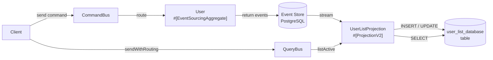

# Tempest Projection — Database Read Model

## 1. What you'll learn

This example shows how to build a **projection** (a read-optimised view) on top of an event-sourced `User` aggregate using Tempest and Ecotone. You will see how the projection's `#[ProjectionInitialization]` hook creates the storage, how `#[EventHandler]` methods react to each domain event, and how the projection lifecycle commands (init, delete, reset) let you wipe and recreate the read model whenever you need to.

It is the Tempest counterpart of the [Laravel `DatabaseReadModel` example](../../../Laravel/Projection/DatabaseReadModel/README.md). The domain code is identical; only the database wiring differs.

## 2. The problem this solves

In a traditional application, if you need a new view on your data — say "all active users ordered by name" — you run a database migration and populate the new table. In an event-sourced system you still have every domain event ever emitted. You can **replay** them into any new shape without touching the write side. This is the projection pattern: the events are the truth; the read model is just a cache you can always discard and rebuild.

## 3. How it fits together



*Files involved:*
- `app/Domain/User.php` — aggregate that produces the events
- `app/Domain/Event/` — `UserWasRegistered`, `UserNameWasChanged`, `UserWasDeactivated`
- `app/ReadModel/UserListProjection.php` — projection that maintains `user_list_database`
- `app/Infrastructure/EcotoneConfiguration.php` — registers the PostgreSQL connection as Ecotone's default `DbalConnectionFactory`
- `app/Infrastructure/ConnectionFactoryInitializer.php` — Tempest initializer that hands the same DBAL connection to the projection
- `app/database.config.php` — the Tempest `PostgresConfig` the connection is derived from

## 4. Walkthrough of the code

### 4.1 Domain — User aggregate

The `User` aggregate is annotated with `#[EventSourcingAggregate]`. Command handlers are `static` for creation (`register`) and instance methods for mutations (`changeName`, `deactivate`). Each handler returns an array of events. `#[EventSourcingHandler]` methods reconstruct aggregate state from stored events — they must have no side effects.

Each event class is annotated with `#[NamedEvent('user.was_registered')]` (and so on). The name is what Ecotone stores alongside the event payload, so the recorded stream stays readable even if you later move or rename the PHP class. The domain layer is framework-agnostic — these files are byte-for-byte identical to the Laravel example.

### 4.2 The projection — direct database writes

`UserListProjection` receives an `Interop\Queue\ConnectionFactory` (Ecotone's DBAL connection) and obtains a Doctrine `Connection` via `createContext()->getDbalConnection()`. Each `#[EventHandler]` method writes directly to the `user_list_database` table with the framework-agnostic Ecotone DBAL idiom. The boolean `active` column is written with `Doctrine\DBAL\ParameterType::BOOLEAN` so PostgreSQL receives a real boolean.

### 4.3 Lifecycle hooks

| Hook | Attribute | What it does |
|------|-----------|--------------|
| Initialise | `#[ProjectionInitialization]` | `CREATE TABLE IF NOT EXISTS user_list_database (...)` |
| Delete | `#[ProjectionDelete]` | `DROP TABLE IF EXISTS user_list_database` |

Resetting the projection is done by deleting and re-initialising it, which clears both the read model table and Ecotone's stored stream position for this projection.

### 4.4 Querying the read model

The `#[QueryHandler('user.listActive')]` method runs a `SELECT` and returns rows as associative arrays. Callers use the query bus:

```php
$rows = $queryBus->sendWithRouting('user.listActive');
// $rows[0]['name'] === 'Alice Cooper'
```

## 5. How the database connection is wired (Tempest specifics)

Tempest has no Laravel-style query builder, so the connection is wired through the `ecotone/tempest` bridge instead of `LaravelConnectionReference`:

1. `app/database.config.php` returns a Tempest `PostgresConfig`. Tempest auto-discovers any `*.config.php` inside the app's discovery locations and registers it as the container's `DatabaseConfig`.
2. `EcotoneConfiguration::databaseConnection()` returns `TempestConnectionReference::defaultConnection()`, registering that `DatabaseConfig` as Ecotone's default `DbalConnectionFactory`. The event store, the DBAL module and the projection state storage all use this single connection.
3. `ConnectionFactoryInitializer` is a Tempest `Initializer` that resolves `Interop\Queue\ConnectionFactory` to the very same `DbalConnectionFactory` from Ecotone's container. This lets Tempest autowire the projection's constructor with the shared connection — one PostgreSQL connection for both the write side (event store) and the read side (projection).

Ecotone discovers the `App\` handlers, aggregates and projections automatically from the composer PSR-4 root — no `ecotone.config.php` is required.

## 6. Running it

```bash
# Start services
docker compose up -d app database

# Install and run inside the container
docker compose exec app bash -lc 'cd quickstart-examples/Tempest/Projection/DatabaseReadModel && composer update && php run_example.php'
```

The script exits 0 and prints a six-step ribbon ending with `== Example completed successfully ==`.

## 7. Reset vs Delete

| Command | Effect |
|---------|--------|
| `ecotone:projection:init` | Calls `#[ProjectionInitialization]`, records projection as known |
| `ecotone:projection:delete` | Calls `#[ProjectionDelete]`, removes projection tracking |

**Reset = delete + re-init.** This two-step approach makes the state transitions explicit: you see the table disappear, then reappear empty.

## 8. Common pitfalls

1. **Forgetting `CREATE TABLE IF NOT EXISTS`.** Without `IF NOT EXISTS` the `init` hook fails if the table already exists, for example after a partial run.
2. **Querying before init.** If you call `user.listActive` before `ecotone:projection:init` the table does not exist and you get a DB error. Always initialise before querying.
3. **Event store accumulates across runs.** This example cleans up the `User` aggregate stream at the start of `run_example.php`. In production you would never delete the event stream — that is your source of truth.
4. **Booleans on PostgreSQL.** Bind boolean columns with `ParameterType::BOOLEAN` so PostgreSQL receives `true`/`false` rather than an empty string.
